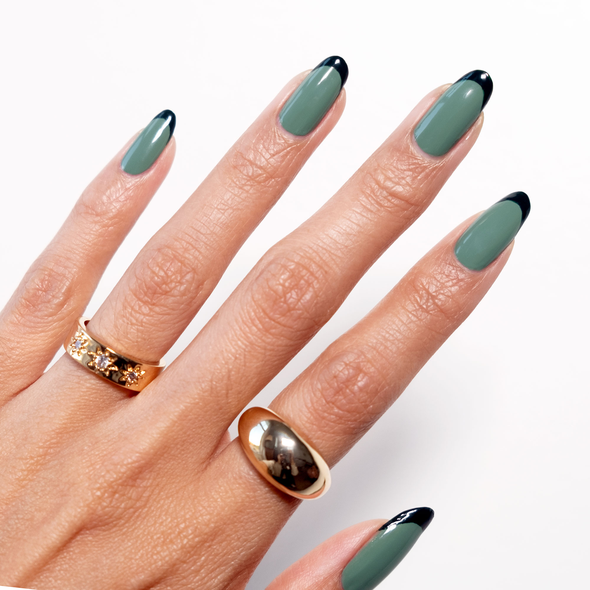

# How to Paint your Nails 
### _by: Gabby Kuhns_

Painting your nails is a fairly simple task, but these instructions will elevate the process and improve results. The more you practice, the easier painting nails becomes and the more you can experiment with different designs and styles.

## Warning: 
##### _Some of the following products are flammable and should be kept out of reach of children._

> [150x200]

## Required Materials

- Nail polish 
   >color and finish of your choice 
- Nail polish top coat 
- Nail polish remover
- Nail clippers & nail file
- Q-tips or cotton swabs
- cuticle oil

## Steps
1. Wash your hands with soap and warm water.

2. Collect necessary materials.
     - place all items on a flat surface 
     - choose somewhere comfortable to sit
     
3. Clip each nail so that they are all around the same length. 

4. File nails into a shape of your choosing. 
    -  almond, square and coffin are all examples of nail shapes
    
5. Open your polish and apply a thin coat to every nail making sure to avoid your cuticles. Let these dry for approximately 10 mins. 
    - use long brush strokes for an even coverage

6. Apply a second coat of nail polish once the first is dry to the touch.
7. Soak the end of a q-tip or cotton swab in nail polish remover and clean anywhere that the polish missed your nail.  
8. Add a top coat to seal in your polish after allowing the second coat to dry.
9. Massage cuticle oil into your nail beds. 
    - give your nails a glowy, hydrated look. 

10. Let dry for no less than an hour or overnight for best results. 

> 
